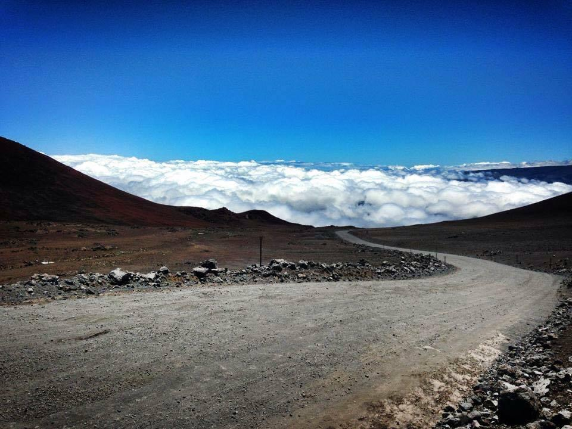

# Localized sea surface temperature (SST) and precipitation variations following volcanic eruptions with a Volcanic Explosivity Index (VEI) greater than 3 in the Aleutian Arc, Hawaiian-Emperor seamount chain, and the greater Ring of Fire

**Michael Cox | Texas A&M University | October 12, 2022**

Mauna Kea, Hawaii, 2013

- [Data Sources](#data-sources)
- [Experimental Design and Analysis](#experimental-design-and-analysis)

## Abstract

Volcanoes are integral to the natural world, serving as powerful agents of both destruction and creation. While their immense power is often associated with volatility and devastation, volcanoes also play a pivotal role in shaping the environment. They contribute to the formation of new landmasses, influencing ecosystems and the development of life as we know it. My fascination with volcanoes began during my time in the U.S. Army, when I first encountered the majestic Mount Rainier dominating the landscape during basic training. Since then, I have worked in various austere environments across the globe, yet I am consistently drawn to locations where volcanoes are present. One of my most memorable experiences was during a military training exercise on the Big Island of Hawaii, where my team and I had the opportunity to hike to the summit of Mauna Kea. The Mauna Kea Observatories, perched at an elevation of 13,796 feet, offered a breathtaking view above the clouds, an experience I vividly remember from 2013.

For my data analysis project, I have chosen to investigate the relationship between volcanic activity, sea surface temperature, and precipitation patterns. Specifically, I will employ a one-way ANOVA design to examine data from volcanic eruptions with a Volcanic Explosivity Index (VEI) of 3 or higher. My experimental setup will include a control group (Group A), consisting of buoy data collected from locations distant from the selected volcanic eruptions. The buoy data I will use is sourced from the National Data Buoy Center (NDBC), which can be accessed at https://www.ndbc.noaa.gov/. 

The primary objective of this study is to determine whether localized sea surface temperatures and precipitation levels are impacted by volcanic eruptions with a VEI greater than 3. By analyzing data from the Aleutian Arc, Hawaiian-Emperor seamount chain, and the greater Ring of Fire, I aim to identify any significant variations in sea surface temperature and precipitation following volcanic eruptions. This research will contribute to our understanding of the complex interactions between volcanic activity and environmental conditions, shedding light on the broader implications of volcanic eruptions on climate and weather patterns.

- For further reading on VEI, visit https://www.usgs.gov/media/images/volcanic-explosivity-index-vei-a-numeric-scale-measures-t
- interactive map from USGS of volcano hazards at: https://www.usgs.gov/programs/VHP
- interactive map from National Data Buoy Center at: https://www.ndbc.noaa.gov/

## Data Sources

**1. The Smithsonian Institution National Museum of Natural History Global Volcanism Program** (https://volcano.si.edu/volcanolist_holocene.cfm)

- The Global Volcanism Program database currently contains 1,332 volcanoes with eruptions during the Holocene period (approximately the last 10,000 years).

- GVP_Volcano_List_Holocene.csv; gvp_confirmed_eruptions_holocene1.csv

**2. The National Oceanic and Atmospheric Administration (NOAA) Physical Sciences Laboratory (PSL) Extended Reconstructed Sea Surface Temperature (SST)** (https://psl.noaa.gov/data/gridded/data.noaa.ersst.v5.html)

- This dataset is a global monthly SST analysis from 1854 to the present derived from ICOADS data with missing data filled in by statistical methods.

- NOAA Extended Reconstructed SST, V5; noaa_sst_v5.nc

**3. The Global Precipitation Climatology Centre (GPCC)** (https://downloads.psl.noaa.gov/Datasets/gpcc/monitor/)

- This dataset provides global precipitation analysis and is maintained by NOAA's Earth System Research Laboratory.

- precip_v2020.nc; precip.monitor.mon.total.1x1.v2020.nc

## Experimental Design and Analysis

**Null Hypothesis (H0)**: Localized sea surface temperatures will not change from the result of a major volcanic eruption with a VEI ≥ 3.

**Alternate Hypothesis (Ha)**: Localized sea surface temperatures will decrease from the result of a volcanic eruption with a volcanic explosivity index VEI ≥ 3.

**Hypothesis (H)**: Localized sea surface temperatures will increase from the result of a volcanic eruption with a VEI $\geq$ 3.

**Groups**: A (Mauana Loa VEI 0) (also our control group); B (Novarupta VEI 6); C (St. Helens VEI 5); D (Kasatochi VEI 4); E (Pavlof VEI 3).

**Replicates**: values are monthly sea surface temperatures (SST, celsius) for periods of 1.) Eruption Day Minus 1 Month, 2.) Eruption Day, 3.) Eruption Day Plus 1 Month.

This is a Natural Experiment; I will be using observation only by testing observations and response variables and not manipulating variables.

Curiosity for whether or not the explosiveness of volcanoes impacts natural processes such as sea surface temperature and precipitation.

My goal is to process geological data on volcanoes, sea surface temperature, and precipitation, and to and perform a one-way analysis of variance ANOVA table design to see whether the VEI size of volcanoes impacts our temperature or precipitation values.  

### Groups

**<u>A</u>** - (control group) - Mauna Loa, VEI 0, March 1984

**<u>B</u>** - Novarupta, VEI 6, June 1912

**<u>C</u>** - St. Helens, VEI 5, March 1980

**<u>D</u>** - Kasatochi, VEI 4, August 2008

**<u>E</u>** - Pavlov, VEI 3, May 2014
